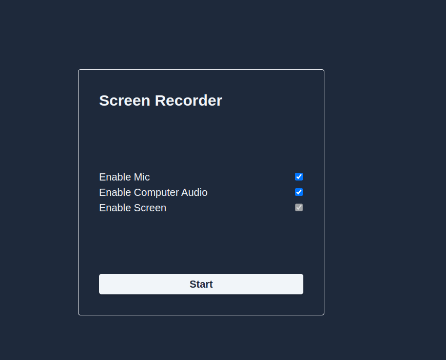

# local-screen-recorder



Local screen recorder with audio. Free (and poor) Loom alternative.

# How to use

[local-screen-recorder-2024-10-16T07_55_59.488Z.webm](https://github.com/user-attachments/assets/2a4fe33f-b756-40fa-95bc-68a6e47e986c)

```
pnpm install
pnpm build
```

Then open dist folder and unpacked extension.

# Development

```
pnpm install
pnpm dev
```
